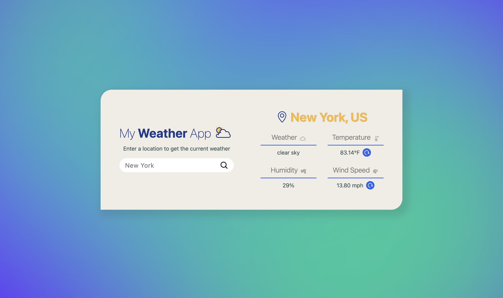

# My Weather App

## Table of Contents

- [Description](#description)
- [Demo](#demo)
- [Features](#features)
- [Technologies Used](#technologies-used)
- [Installation](#installation)
- [Usage](#usage)
- [API Integration](#api-integration)
- [Project Structure](#project-structure)
- [Contributing](#contributing)
- [License](#license)
- [Acknowledgments](#acknowledgments)
- [Contact Information](#contact-information)

## Description

The Weather App is a responsive web application designed to showcase my skills as a frontend engineer. This app provides real-time weather updates, including temperature, humidity, and wind speed for any chosen location. It is built using Next.js and Tailwind CSS, leveraging their capabilities to create a seamless and efficient user experience.

### Purpose

The primary purpose of this app is to demonstrate my ability to develop responsive and interactive web applications. It serves as a portfolio piece to present to potential employers and clients looking to hire me for freelance projects.

### Problem Solved

The app addresses the need for quick and accessible weather information. By simply entering a location, users can obtain current weather conditions, making it useful for everyday planning and decision-making.

### Target Audience

The app is aimed at potential employers and clients who are interested in evaluating my frontend development skills. It also serves anyone who requires a simple and effective way to check weather conditions.

### Key Features

Location-Based Weather: Users can search for weather information by entering any location.
Real-Time Updates: Provides current weather data, including temperature, humidity, and wind speed.
Responsive Design: Ensures a seamless experience across various devices and screen sizes.
Unique Aspects
While the app utilizes the widely-used OpenWeather API, it stands out due to its clean and responsive design, achieved through the combination of Next.js and Tailwind CSS.

### Technology Stack

- Next.js: Utilized for its powerful features like server-side rendering and static site generation, enhancing SEO and performance.
- Tailwind CSS: Allows for rapid styling and customization, ensuring a modern and cohesive design.
- OpenWeather API: Fetches accurate and up-to-date weather data.
  User Experience
  The app is designed to be intuitive and user-friendly, with a focus on responsive design and ease of navigation. Users can effortlessly search for weather information for any location of their choosing.

### Development Challenges

During development, I encountered challenges with handling ChangeEvent and KeyboardEvent, as well as fetching data from the API. Through persistence and trial and error, I was able to resolve these issues and achieve the desired functionality.

## Demo

[Live Demo](#)



## Features

- Real-time weather updates
- Location-based weather
- Responsive design

## Technologies Used

- [Next.js](https://nextjs.org/) - A React framework for server-side rendering and static site generation.
- [Tailwind CSS](https://tailwindcss.com/) - A utility-first CSS framework for rapid UI development.
- [OpenWeather API](https://openweathermap.org/api) - Provides weather data including current conditions, forecasts, and historical data.

## Installation

1. Clone the repository:
   ```bash
   git clone https://github.com/yourusername/weather-app.git
   ```
2. Install dependencies:
   ```bash
   cd weather-app
   npm install
   ```
3. Add your API key in `.env.local` file:
   ```env
   NEXT_PUBLIC_WEATHER_API_KEY=your_api_key_here
   ```
4. Start the development server:
   ```bash
   npm run dev
   ```

## Usage

Open your browser and navigate to `http://localhost:3000`.

## API Integration

This app uses the [OpenWeather API](https://openweathermap.org/api). You can get your API key by signing up on their website.

## Contributing

If you'd like to contribute, please fork the repository and use a feature branch. Pull requests are warmly welcome.

## License

This project is licensed under the MIT License.

## Acknowledgments
- [Next.js Documentation](https://nextjs.org/docs)
- [Tailwind CSS Documentation](https://tailwindcss.com/docs)
- [MDN Web Docs](https://developer.mozilla.org/)
- [GeeksForGeeks](https://www.geeksforgeeks.org/)
- [W3Schools](https://www.w3schools.com/)

## Contact Information

- Email: [alex.lozadareyes@icloud.com](mailto:alex.lozadareyes@icloud.com)
- GitHub: [AlexLozada32](https://github.com/AlexLozada32)
- LinkedIn: [Alejandro Lozada](https://www.linkedin.com/in/alejandro-lozada-960b05284/)
- Facebook: [Alejandro Lozada](https://www.facebook.com/alereyesss05/)
- Instagram: [alejomiguel\_](https://www.instagram.com/alejomiguel_/)
